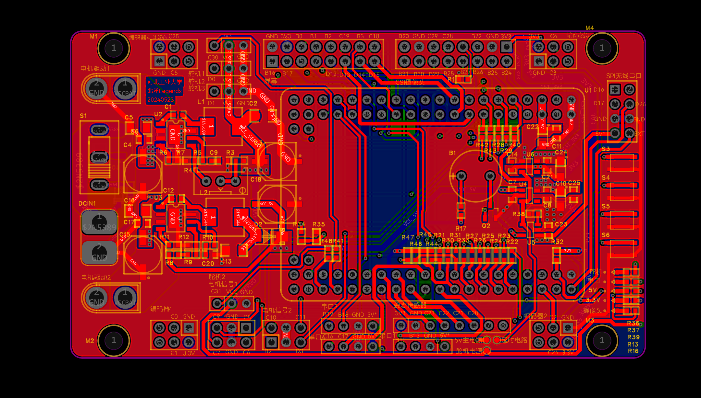
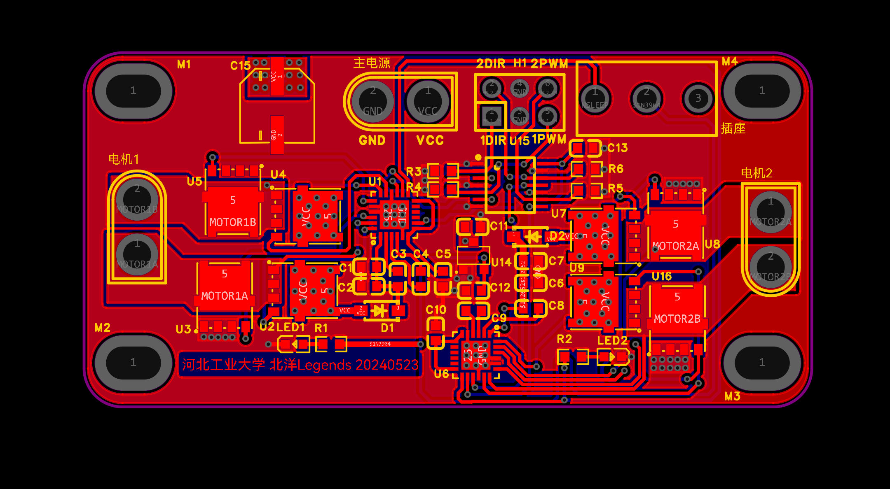

# Smart Car Embedded Vision System

智能车嵌入式视觉控制系统

This repository records an embedded smart-car competition project built around RT1064 firmware, OpenART visual recognition, IMU feedback, motor/steering control, PCB iteration, and repeated vehicle bring-up.

本仓库保存的是智能车竞赛阶段的代码和调试记录，重点包括 RT1064 主控、OpenART 视觉识别、IMU 调参、PCB 迭代、车辆运动控制和现场调车过程。它更像一个工程快照和复盘记录，不是可以直接复制到任意电脑上编译烧录的完整环境。

Competition context: 19th National Undergraduate Smart Car Competition, Vision Group, regional second prize.

竞赛背景：第十九届全国大学生智能汽车竞赛，视觉组，赛区二等奖。

## Project At A Glance

| Item | Summary |
|---|---|
| Competition | 19th National Undergraduate Smart Car Competition, Vision Group. |
| System type | RT1064 embedded vehicle-control firmware with OpenART visual recognition, IMU/encoder feedback, actuator control, and PCB iteration. |
| Repository focus | Public-safe firmware snapshot, OpenART scripts, PCB images/exports, IMU notes, and bring-up notes. |
| My role | PCB design, soldering, board iteration notes, and public repository maintenance. |
| Not included | Full raw competition package, private media/certificates, unreleased teammate materials, binary build outputs, board-vendor SDK bundles, and unreviewed third-party files. |

## Competition Task Context

The Vision Group task combines autonomous vehicle control and visual target-board handling. The car starts from the starting area, follows the track as a ground-guidance map, searches for scattered or stacked target boards, detects and classifies them, and transports them to the required placement areas.

第十九届视觉组的核心不是单纯循迹，而是“循迹 + 目标板搜索 + 视觉分类 + 搬运放置”的整车系统任务。项目需要把 RT1064 主控、总钻风赛道图像、OpenART 识别、四麦轮运动控制、编码器/IMU 反馈、舵机/电磁铁执行机构和自制 PCB 一起调通。

See [docs/competition-task.md](docs/competition-task.md) for the rule-derived task explanation and repository mapping.

## Visual Materials

This repository uses only real project materials already included in the public-safe snapshot.





## Project Overview

The core control flow is:

```text
camera / vision input
  -> OpenART recognition / target detection
  -> RT1064 decision logic
  -> PD/PID, wheel-speed, servo, and handling commands
  -> motor driver and actuator output
  -> IMU feedback and field debugging
```

## Repository Layout

| Area | Path | Purpose |
|---|---|---|
| RT1064 firmware | `firmware/rt1064/project/code/` | Application-level modules for camera input, mission logic, motor control, steering, encoders, filters, IMU, UART, and wireless communication. |
| MDK project files | `firmware/rt1064/project/mdk/` | Minimal Keil/MDK project metadata for understanding the embedded build setup. |
| OpenART scripts | `firmware/openart/` | Upper/lower OpenART scripts, serial command modes, labels, and deployment helpers. |
| IMU notes | `hardware/imu/` | IMU660RA configuration and tuning notes. |
| PCB files | `hardware/pcb/` | Schematic/PCB screenshots and EasyEDA project exports from the competition iteration. |
| Competition context | `docs/competition-task.md` | 19th Vision Group task, constraints, and project mapping. |
| Contribution scope | `docs/contribution-scope.md` | Team contribution split and public repository boundary notes. |
| Bring-up notes | `docs/raw-notes/bringup-log.zh-CN.txt` | Field notes from vehicle debugging. |

## How To Read The Firmware Snapshot

The most relevant application modules are:

- `box_logic_code.c`: high-level mission and box/logic handling.
- `camera.c`: camera processing and visual input handling.
- `car_move.c`: vehicle movement, chassis-level command conversion, and motion modes.
- `motor.c`, `encoder.c`, `smotor.c`, `steer.c`: actuator and feedback control.
- `filter.c`, `Fuzzy.c`, `location.c`, `tracking.c`: filtering, steering assistance, localization, and path tracking.
- `u660.c`: IMU interface and attitude-related integration.
- `wifi.c`, `wir_usart.c`, `wirles_usart.c`: wireless and serial communication.

The firmware directory keeps the application-level code and the project metadata that help explain the embedded control chain. To rebuild the firmware on hardware, recreate the matching board SDK, startup files, compiler settings, and local toolchain configuration for the actual RT1064 development board.

这里保留的是便于阅读和复盘的应用层代码。若要真正编译上板，需要按所用开发板和工具链补齐对应 SDK、启动文件和本地编译配置。

The only Python files kept in this repository are OpenART-side scripts or deployment helpers. Standalone explanatory Python examples are not part of the competition snapshot.

## Documents

- `docs/competition-task.md`: 19th Vision Group task context and project mapping.
- `docs/contribution-scope.md`: team contribution split and public repository boundaries.
- `docs/system-architecture.md`: system-chain diagram.
- `docs/hardware.md`: hardware and PCB overview.
- `docs/openart-vision.md`: OpenART command modes and deployment notes.
- `docs/imu-tuning.md`: IMU tuning summary.
- `docs/bringup-log.md`: vehicle bring-up milestone log.

## PCB Status

The PCB files are snapshots from the competition-stage iteration. They are useful for showing the electrical design process, but they are not claimed to be final production-ready boards. Further schematic cleanup, interface labeling, and board-review notes can be added later.

PCB部分是竞赛阶段的迭代记录，可以体现设计过程，但后续仍有优化空间，例如接口标注、原理图说明、板级复盘和可制造性检查。

## Team And Copyright

This project was completed in a team competition setting. The competition result and engineering work should be understood as collaborative work; every teammate's contribution deserves proper credit. This repository is maintained by Tian Bingzhuo as a readable record of the code, hardware notes, and debugging process from the competition stage.

Known contribution split:

| Member | Main contribution |
|---|---|
| 戴哲维 | Main program / RT1064 vehicle-control firmware. |
| 葛洪飞 | Main program / RT1064 vehicle-control firmware. |
| 黄得时 | Mechanical structure. |
| 么林坤 | Vision part, including OpenART-related recognition work. |
| 田秉卓 | PCB design, soldering, board iteration notes, and public repository maintenance. |

已知分工如下：

| 成员 | 主要贡献 |
|---|---|
| 戴哲维 | 主程序编写，RT1064 整车控制固件相关工作。 |
| 葛洪飞 | 主程序编写，RT1064 整车控制固件相关工作。 |
| 黄得时 | 机械结构制作与相关调试。 |
| 么林坤 | 视觉部分，包括 OpenART 识别相关工作。 |
| 田秉卓 | 电路板设计、焊接、板级迭代记录，以及本公开仓库维护。 |

本项目来自团队竞赛，成果不是单人完成。上表用于说明当前已知主要分工；如后续需要补充更精确的成员署名、代码归属或授权说明，应以团队共识为准。

Unless otherwise stated, code and documents authored for this repository use the Apache License 2.0 where the contributors have the right to license them. SDKs, model files, libraries, board packages, and vendor materials should follow their own licenses.
