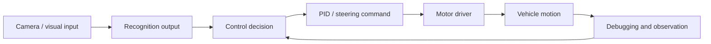

# System Architecture Draft

## Notes

- This diagram is a public abstraction, not a copy of raw competition materials.
- The future ROS 2 mapping can treat recognition output as a topic, the controller as a node, and the motor driver as an actuator interface.

