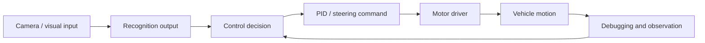

# System Architecture

## Notes

- OpenART provides visual recognition results to the RT1064 control logic.
- The RT1064 firmware combines recognition output, encoder/IMU feedback, and mission state to generate steering and motor commands.
- For a future ROS 2 version, recognition output can be treated as a topic, the controller as a node, and the motor driver as an actuator interface.
