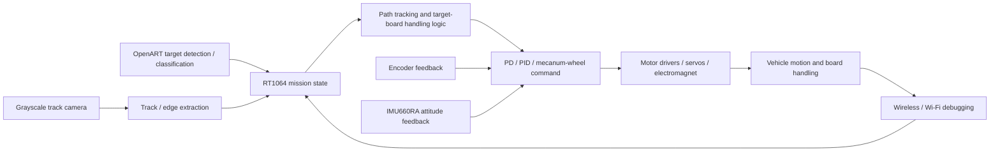
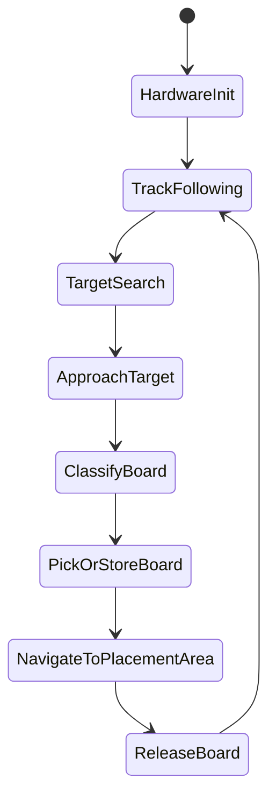

# System Architecture

## Task-Driven Flow

The 19th Vision Group task shaped the system as an integrated chain:

1. Follow the track to reach useful search areas.
2. Detect scattered or stacked target boards.
3. Classify target boards through OpenART recognition.
4. Move the four-mecanum-wheel chassis to pick or place boards.
5. Use encoder and IMU feedback to keep speed, heading, and translation stable.
6. Use wireless/Wi-Fi debugging during bring-up, then keep official-run configuration compliant.

## Notes

- OpenART provides target-board detection and classification results to the RT1064 control logic.
- The RT1064 firmware combines track-camera input, OpenART recognition output, encoder feedback, IMU attitude feedback, and mission state to generate motor, servo, and handling commands.
- The main program work was mainly handled by 戴哲维 and 葛洪飞; the vision part was mainly handled by 么林坤; mechanical structure was mainly handled by 黄得时; PCB design and soldering were mainly handled by 田秉卓.
- For a future ROS 2 version, recognition output can be treated as a topic, the controller as a node, and the motor/servo/electromagnet outputs as actuator interfaces.
